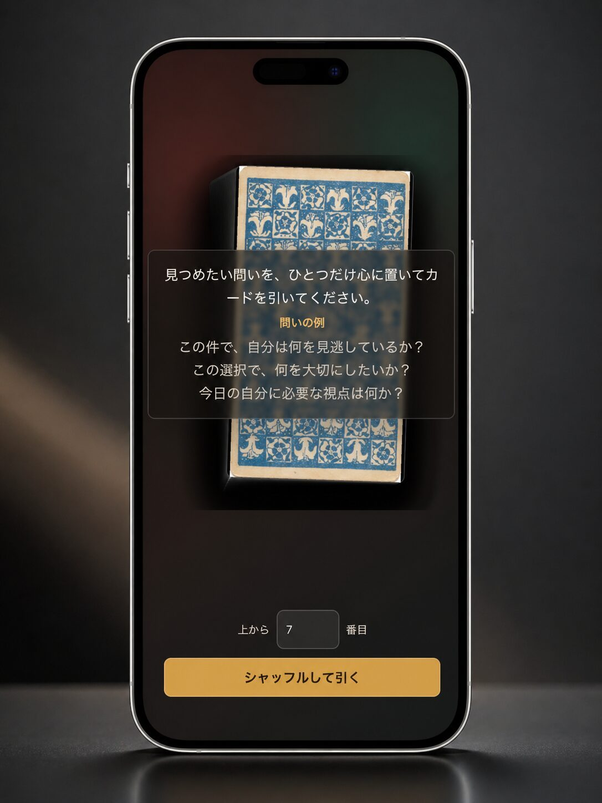
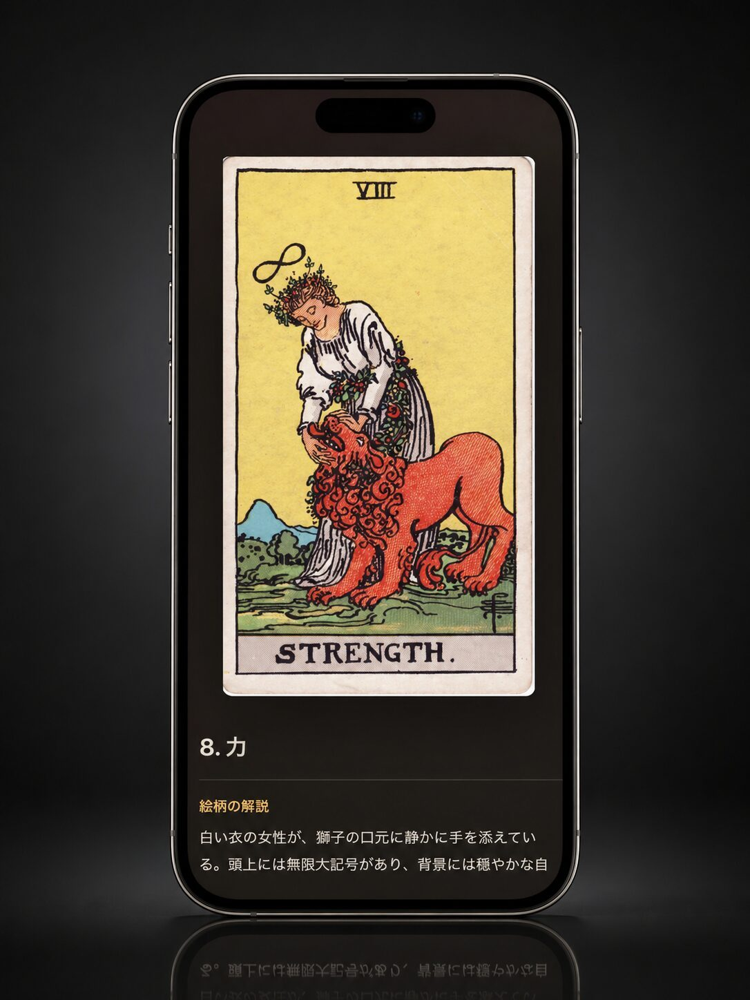

# Draw Tarot

[English](README.en.md) | 日本語

問いをひとつ心に置いて、タロットカードを1枚引く小さなWebアプリです。

大アルカナ22枚からカードをシャッフルし、選んだ位置のカードを表示します。
カードごとに、絵柄の読み解き、ポジティブ/ネガティブなキーワード、生命の樹での位置づけを添えています。

占いというより、思考の角度を少し変えるための道具です。
結論を外注するのではなく、自分の中の別の声を呼び出すためにどうぞ。

## Screenshot

<p>
  
  
</p>

## 使い方

[https://hnsol.github.io/draw-tarot/](https://hnsol.github.io/draw-tarot/)
を開くだけで使えます。

アカウント登録もインストールも不要です。水晶玉も不要です。

## できること

- 迷っていることを、少し違う角度から眺められます。
- 「なんとなく」を言葉にするきっかけを作れます。
- 1枚引きなので、短い休憩時間でも気軽に使えます。
- カードの意味だけでなく、絵柄から連想を広げられます。
- ブラウザだけで動くので、スマホでもPCでもすぐ試せます。

## 開発

```sh
npm test
```

## タロットカード画像について

本プロジェクトの画像は、Wikimedia Commons の
[Vectorized Tarot by Immanuelle](https://commons.wikimedia.org/wiki/Category:Vectorized_Tarot_by_Immanuelle)
をもとにしています。

- ライセンス: パブリックドメイン。Pamela Colman Smith による原画です。
- 使用データ: 各SVGファイルページの Media Viewer から取得した、オリジナルサイズのJPG画像です。
- 参照例: [RWS Tarot 17 Star.svg](https://commons.wikimedia.org/wiki/File:RWS_Tarot_17_Star.svg)
- 詳細: 各画像の来歴は、Wikimedia Commons の個別ページを参照してください。

## ライセンス

このリポジトリのコードは [MIT License](LICENSE) で公開しています。
画像は上記の通りパブリックドメインです。
